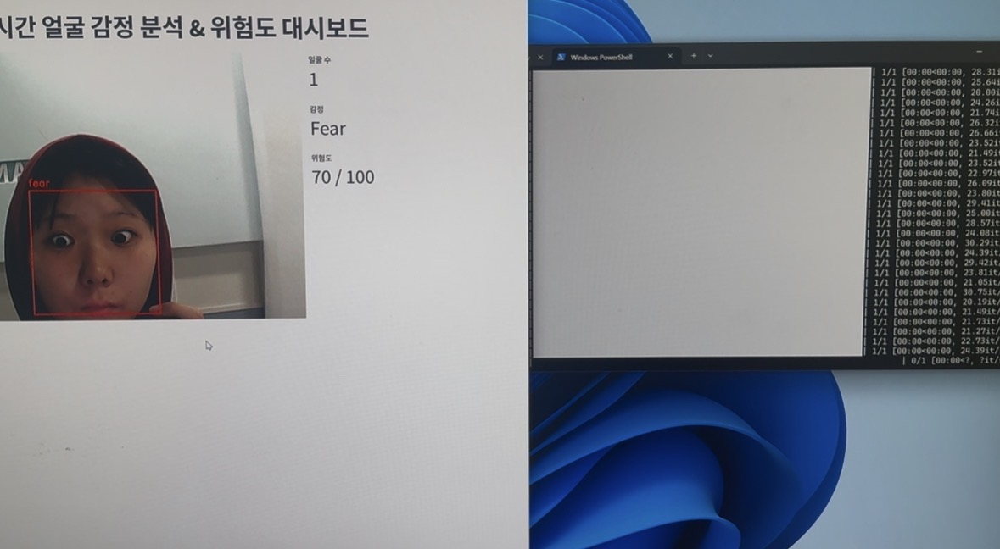
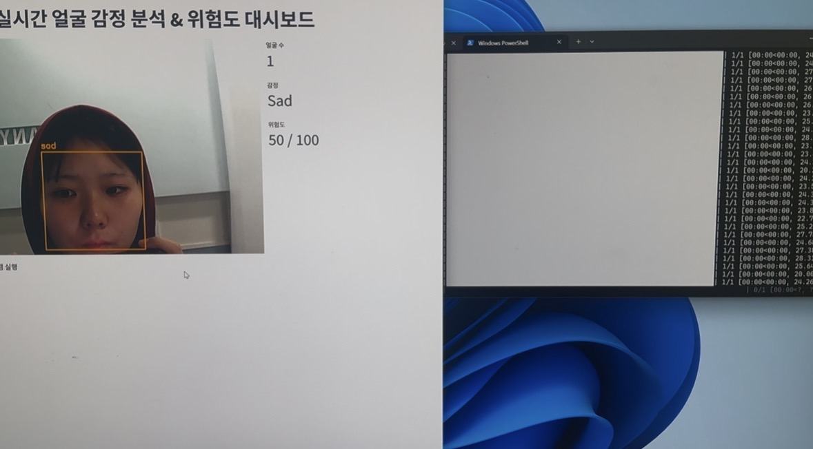
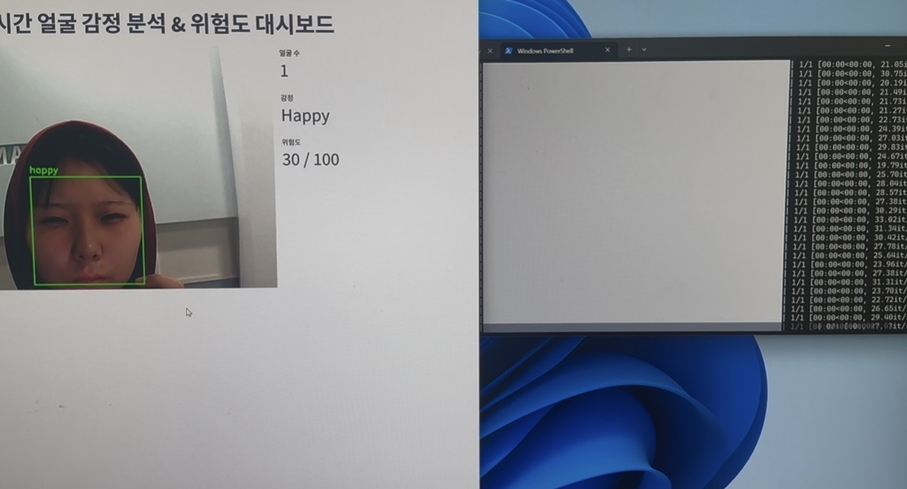
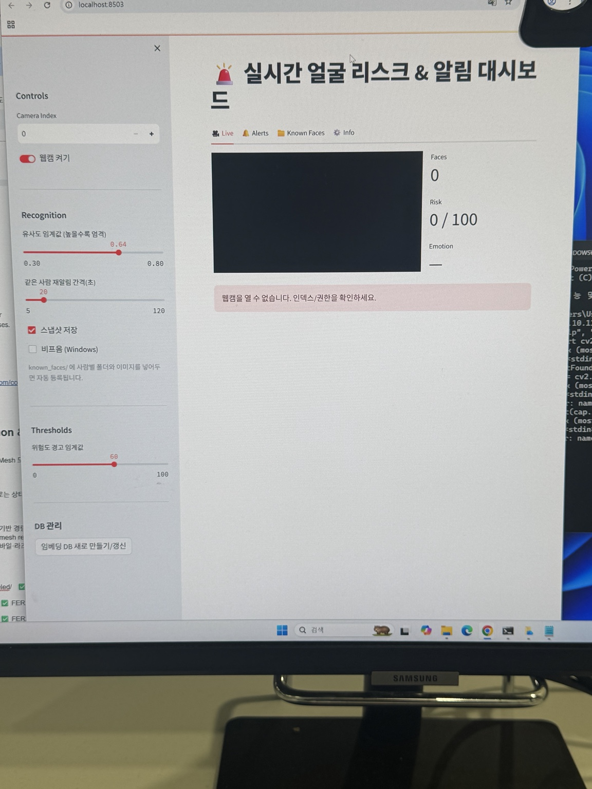
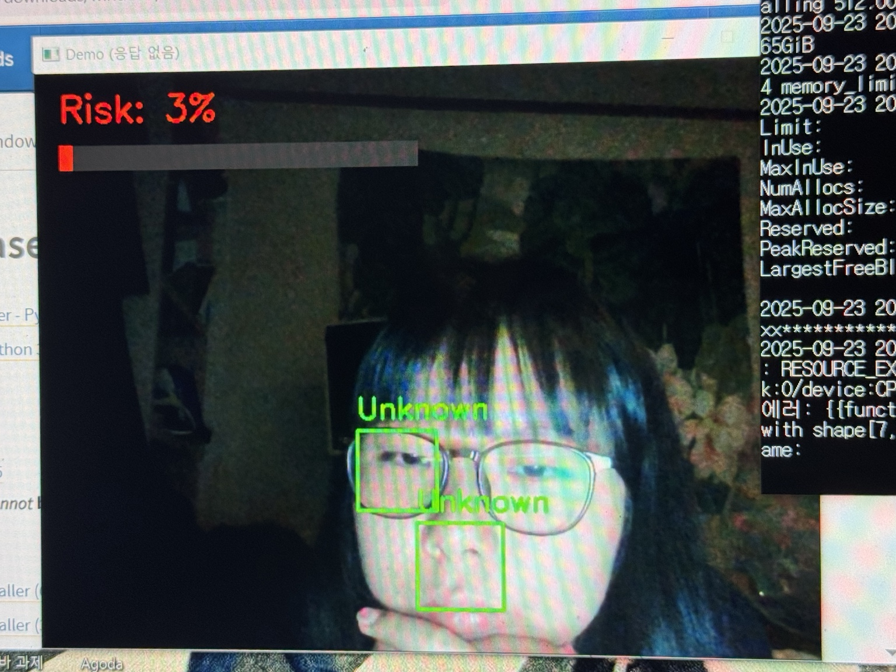

# PYEYE AI Risk Detection System


Real-time AI risk detection system using face recognition and emotion analysis.
## Overview

PYEYE is an AI-based monitoring system that detects faces in real time and analyzes emotional states to estimate potential risk levels.

This project was developed as a capstone design project using Raspberry Pi 4, Python, OpenCV, MediaPipe, and Streamlit.

---

## Main Features

- Real-time face recognition
- Emotion analysis
- Risk score calculation
- Streamlit dashboard visualization
- Event logging system
- Webcam-based monitoring

---

## Technology Stack

- Python
- OpenCV
- MediaPipe
- Streamlit
- Pandas
- Seaborn
- SQLite
- Raspberry Pi 4

---

## Installation

```bash
git clone https://github.com/dleksal/PYEYE-AI-Risk-Detection.git
cd PYEYE-AI-Risk-Detection
pip install -r requirements.txt
streamlit run app.py
```

---


## System Architecture

1. Camera Input  
2. Face Detection  
3. Emotion Analysis  
4. Risk Scoring  
5. Visualization & Alert  
6. Data Logging

---

## Project Goal

Traditional CCTV systems mainly record incidents after they occur.

PYEYE aims to overcome this limitation by detecting emotional signals and potentially dangerous situations in real time.

---

## Challenges & Solutions

### Raspberry Pi performance limitation
Running real-time face and emotion analysis on Raspberry Pi caused performance issues.

**Solution:** Optimized the processing pipeline and tested lightweight execution methods.

### Webcam connection issue
The webcam was not always recognized correctly during real-time detection.

**Solution:** Tested different camera inputs and adjusted camera index settings.

### TensorFlow dependency issue
DeepFace and TensorFlow dependencies caused compatibility problems.

**Solution:** Adjusted package versions and tested the environment repeatedly.

## Future Improvements

- Multi-camera support
- Improved emotion analysis accuracy
- GPU acceleration
- Cloud integration

## How It Works

1. Webcam captures real-time video input.
2. Face detection identifies faces from the camera stream.
3. Emotion analysis classifies the detected facial expression.
4. Risk score is calculated based on emotion type.
5. Streamlit dashboard visualizes emotion and risk level.
6. Events can be logged for monitoring purposes.

   
---

## Author

GitHub: dleksal

## Demo Screenshots

### Fear Detection


### Sad Detection


### Happy Detection


### Dashboard UI


### Raspberry Pi Deployment

